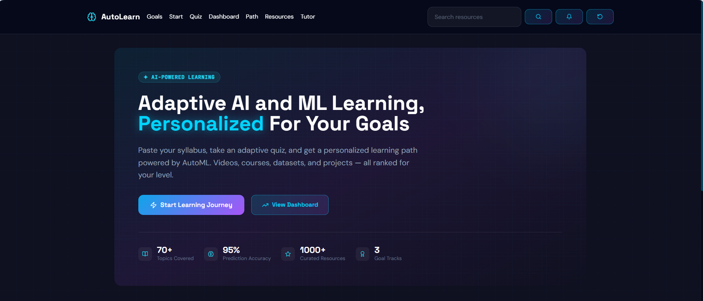
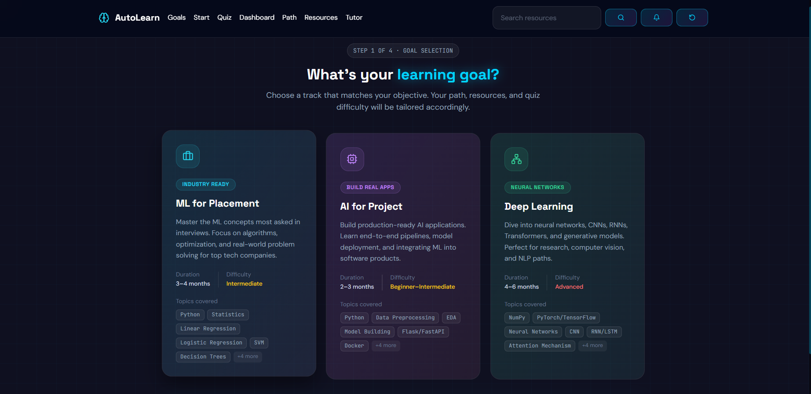
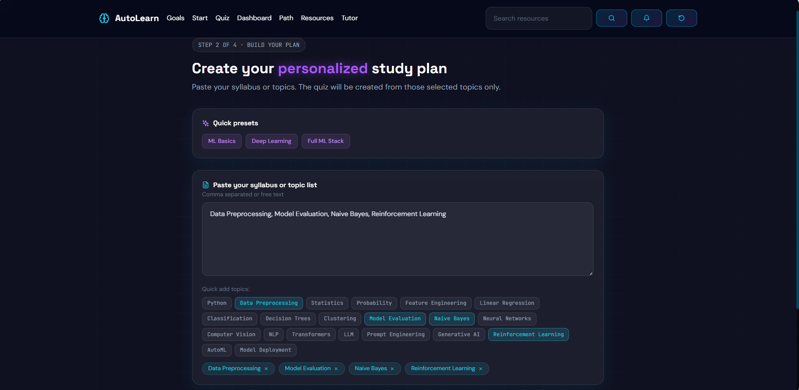
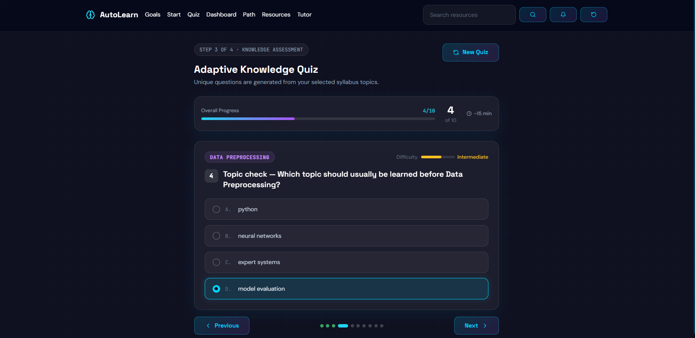
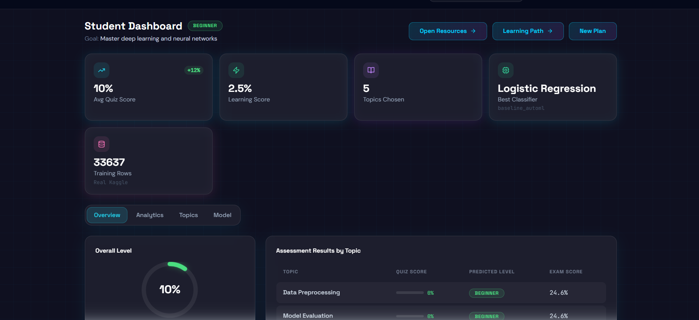
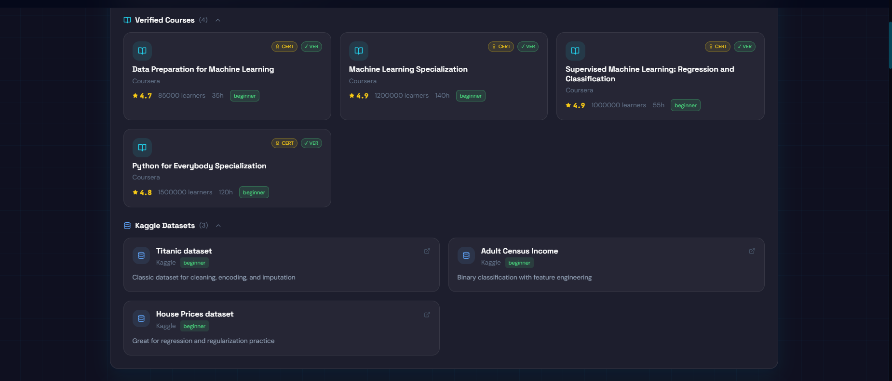
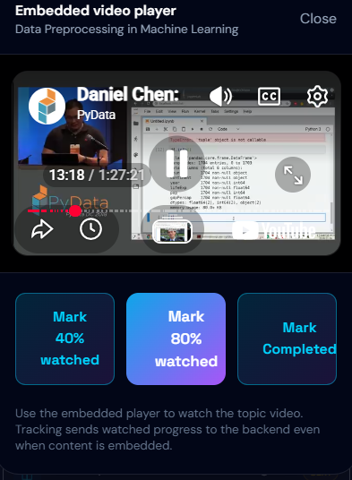
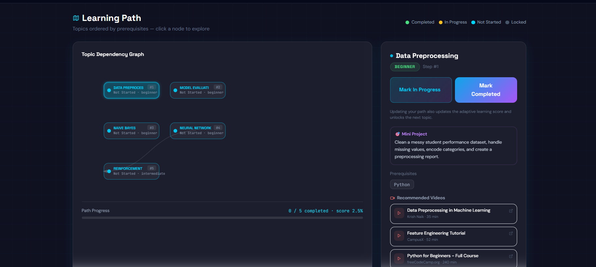
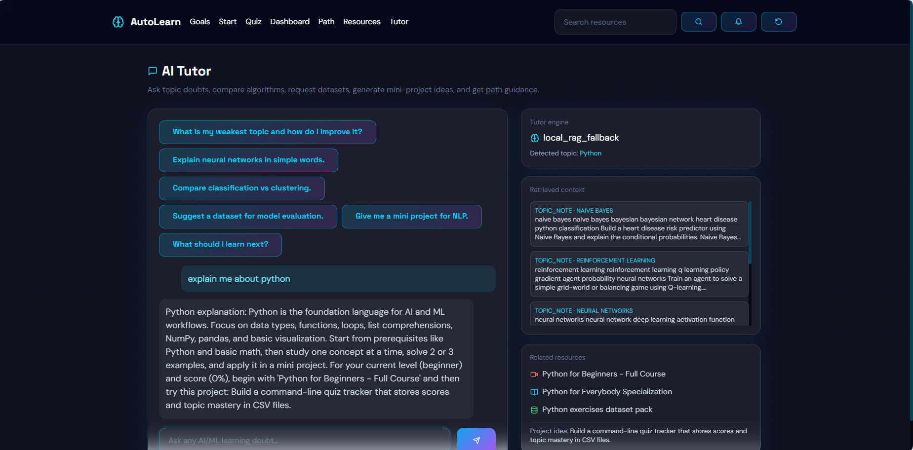

# AI & ML Adaptive Learning Platform

AI & ML Adaptive Learning Platform is a full-stack AI-powered personalized learning platform that helps students create structured study plans, take adaptive quizzes, track learning progress, and discover curated machine learning and deep learning resources.

It combines a React frontend with a Flask backend to deliver an interactive learning experience with analytics, resource recommendations, and an LLM-ready tutor workflow.

---

## Features

- Goal-based learning tracks
- Personalized study plan generation from syllabus or selected topics
- Adaptive knowledge quiz with topic-aware questions
- Student dashboard with learning score and topic-wise assessment
- Weak-area detection and performance analysis
- Curated verified courses and Kaggle datasets
- Embedded video progress tracking
- LLM-ready tutor with local retrieval fallback
- Learning path guidance with prerequisite-aware topic flow

---

## Screenshots

### Dashboard Overview


### Goal Selection


### Study Plan Builder


### Adaptive Quiz


### Topic Assessment Results


### Resources: Courses and Datasets


### Video Progress Tracking


### Learning Path


### AI Tutor


---

## Learning Tracks

- ML for Placement
- AI for Project
- Deep Learning

---

## Tech Stack

### Frontend
- React.js
- React Router
- Tailwind CSS
- Framer Motion
- Recharts
- Axios
- Lucide React

### Backend
- Flask
- Python
- REST APIs

### Data / AI / ML
- Scikit-learn
- Pandas
- NumPy
- Curated dataset catalogs
- Topic-based quiz generation
- Recommendation and ranking workflow
- Learning performance prediction

---

## Project Structure

```text
ai-ml-adaptive-learning-platform/
├── frontend/
│   ├── public/
│   ├── src/
│   ├── package.json
│   └── tailwind.config.js
├── services/
├── templates/
├── static/
├── data/
├── screenshots/
├── app.py
├── resources.py
├── requirements.txt
├── .env.example
├── .gitignore
├── README.md
└── RUN.md